# Cloud-Native IoT Temperature Monitoring System for Refrigerated Cargo Ships

## Project Report

**Course**: EN.605.702.81.SP26 Cloud-native Architecture and Microservices

**Project**: Individual Project Part One

**Name**: Duy Nguyen

**Date**: 11 February 2026

## I. Executive Summary

This project implements a cloud-based IoT temperature monitoring and regulation system for refrigerated seafood transportation cargo ships. The system demonstrates cloud computing concepts through two distinct deployment architectures (the third is not implemented due to constraints of the project), each showcasing different levels of distributed system complexity and cloud service integration. The project was designed and deployed as a distributed application using **4 core cloud components**:

1. **Messaging/Queuing**: Amazon SQS
2. **Caching**: Amazon ElastiCache (Redis)
3. **Database**: Amazon RDS (PostgreSQL)
4. **Compute**: Amazon EC2

## II. Problem Statement and Business Value, restated

Seafood transportation companies rely heavily on refrigerated cargo storage to maintain product quality and comply with strict food safety regulations across international markets. During long trips, shipments often pass through varying climate zones where temperatures can change rapidly, with fluctuating environmental conditions, some harsh and unpredictable.

Traditional temperature monitoring systems are often limited to local, ship-based control mechanisms. While these systems can trigger basic alarms, they severely lack functionalities that allow businesses to tightly control and easily scale their operations. A cloud platform thus can play a central role in system reliability, visibility, scalability, and long-term data management.

A cloud-based architecture would enable the system to:

- Detect prolonged local hardware overload or failure on local devices and support rapid recovery using centrally stored - configuration and historical data.
- Provide real-time remote monitoring without requiring personnel to be physically onboard the vessel.
- Store and analyze historical trips’ data to support trend analysis and route optimization.
- Manage ships as part of a centralized fleet, allowing coordinated manual temperature overrides and oversight across multiple vessels
- Maintain accurate, continuously updated records to support regulatory compliance, auditing, and legal reporting requirements.

## III. System Architecture

### a. Three-Component Design

#### Component A: IoT Data Ingestion Service

- **Role**: Data collection and validation
- **Technology**: Node.js Express server on EC2
- **Responsibilities**:
  - Expose HTTP endpoint to receive periodical temperature readings from onboard IoT sensors
  - Validate and normalize received telemetry (ship_id, temperature, timestamp)
  - Queue messages to TelemetryQueue (SQS) for asynchronous processing

#### Component B: Data Processing and Business Rule Applicator (Worker)

- **Role**: Core business logic and decision-making
- **Technology**: Node.js worker process on EC2
- **Responsibilities**:
  - Poll TelemetryQueue (SQS) for telemetry messages
  - Retrieve ship-specific thresholds from Redis cache
  - Evaluate temperature against business rules
  - Determine alert type (NORMAL, WARNING, CRITICAL)
  - Check temperature trends via PostgreSQL (read-only)
  - Publish enriched events to EventsQueue (SQS), including TREND_ANOMALY events

#### Component C: Event Executor

- **Role**: Data persistence, action execution, and notifications
- **Technology**: Node.js worker process on EC2
- **Responsibilities**:
  - Poll EventsQueue (SQS) for processed events
  - Store telemetry readings in PostgreSQL
  - Create alerts and temperature adjustment requests
  - Store trend anomaly alerts when received from Component B
  - Send webhook notifications

### b. Architecture Diagrams

#### Local Development

```text
                Your Computer (localhost) + Docker + LocalStack

Simulator ──HTTP POST──>   Ingestor (:3000)
                              │
                        TelemetryQueue (SQS) (:4566)
                              │
                            Worker ─── Redis (thresholds) (:6379)
                              │    └── PostgreSQL (trend reads) (:5432)
                              │
                        EventsQueue (SQS) (:4566)
                              │
                           Executor ── PostgreSQL (storage) (:5432)
```

#### AWS Monolithic (Implementation 1)

```text
                  1 single EC2 Instance (t3.micro, PM2)

Simulator ──HTTP POST──>   Ingestor (:3000)
                              │
                        TelemetryQueue (SQS)
                              │
                            Worker ─── ElastiCache (Redis) (thresholds)
                              │    └── RDS (PostgreSQL) (trend reads)
                              │
                        EventsQueue (SQS)
                              │
                           Executor ── RDS (PostgreSQL) (storage)
```

#### AWS Distributed (Implementation 2)

```text
Simulator ──HTTP POST──> EC2 Ingestor (:3000)
                              │
                        TelemetryQueue (SQS)
                              │
                        EC2 Worker ─── ElastiCache (Redis) (thresholds)
                              │    └── RDS (PostgreSQL) (trend reads)
                              │
                        EventsQueue (SQS)
                              │
                        EC2 Executor ── RDS (PostgreSQL) (storage)
```

### c. Data Flow

```text
Ingestor (Component A)
  POST /telemetry → validate → normalize → queue to SQS → return 200
       │
       v
  TelemetryQueue (SQS)
       │
       v
Worker (Component B)
  Poll SQS → get thresholds (Redis) → evaluate rules → publish event to SQS
  Check temperature trend (PostgreSQL) → if rising → publish TREND_ANOMALY alert
       │
       v
  EventsQueue (SQS)
       │
       v
Executor (Component C)
  Poll SQS → loop over evaluation.actions:
    LOG → store telemetry (PostgreSQL)
    NOTIFY_WARNING → store alert + send notification
    NOTIFY_CRITICAL → store alert + send notification
    ADJUST_TEMPERATURE → store alert + adjust temp
    TREND_ALERT → store alert
```

### d. Component Interaction Analysis

As can be seen from the data flow and the architecture diagrams, the three components never communicate directly, but instead every interaction has at least one or more AWS managed services served as middlemen (SQS, Redis, or PostgreSQL). This design improves considerably scalability, performance, and efficiency.

#### SQS as the Decoupling Layer (A -> B, B -> C)

Two SQS queues form the backbone of the pipeline. Because the Ingestor writes to TelemetryQueue and the Worker reads from it independently (or the Worker writes to EventsQueue and the Executor reads from it independently), neither component needs to know the other exists. This helps with:

- **Scalability**: e.g. adding more Worker instances in case of overload does not require any code changes to the Ingestor nor the Executor component groups, instead, SQS distributes messages automatically via its emitter-consumer model.
- **Isolation**: If the Executor slows down (e.g. database write latency spikes), EventsQueue absorbs the backlog. The Worker continues processing at full speed and can keep pushing messages to the queue without having to wait for component C to catch up. A bottleneck in Component C cannot propagate upstream to Component B or A.
- **Efficiency**: Three SQS optimizations minimize API costs:
  - *Long polling* (`WaitTimeSeconds: 20`): Instead of calling SQS repeatedly and getting empty responses, each poll waits up to 20 seconds for messages to arrive. If a message appears at second 3, it returns immediately; and if nothing arrives after 20 seconds, it returns empty. This eliminates thousands of wasted API calls per hour.
  - *Batch receive* (`MaxNumberOfMessages: 10`): Each poll fetches up to 10 messages at once in batch instead of one at a time.
  - *Batch delete* (`DeleteMessageBatchCommand`): After processing, all messages are deleted in a single API call instead of one call per message.

  Combined, batching reduces API calls by ~90%: processing 10 messages requires 1 receive + 1 delete = 2 API calls, versus 10 receives + 10 deletes = 20 calls without batching.

- **Reliability**: SQS retains messages for 24 hours (`MessageRetentionPeriod: 86400`). If a consumer crashes mid-processing, the visibility timeout (30 seconds) expires and the message becomes available to another consumer, ensuring no data loss.

#### Redis as the Caching Layer (Worker retrieving ship thresholds)

The Worker retrieves ship-specific temperature thresholds from Redis on every message. Without caching, this would require three PostgreSQL queries per message (warning, critical, target thresholds). With Redis:

- **Performance**: Cache reads complete 10-30 times faster than a database query. For a large number of messages, this saves exponential amount of cumulative database query time per minute.
- **Scalability**: Redis has the capability to handle ~100,000 reads/second i.e. 100,000 ship threshold lookups per second on a single `cache.t3.micro` node.
- **Reliability**: thresholds are loaded once during setup (`npm run setup:cache`) and read many times. The Worker falls back to hardcoded defaults in `config.js` if a Redis key is missing, so a cache failure degrades gracefully rather than crashing the pipeline.

#### PostgreSQL Read/Write Separation (Worker reads, Executor writes)

The Worker and Executor access the same PostgreSQL instance but with different access patterns:

- **Worker (read-only)**: Queries `telemetry_readings` for trend analysis, which is a `SELECT` query for all telemetry data per ship over the last 5 minutes. This is a lightweight, indexed read that does not compete with write locks.
- **Executor (write-heavy)**: Inserts into `telemetry_readings`, `alerts`, and `temperature_actions`. These are append-only writes that benefit from PostgreSQL's sequential write optimization.

This read/write separation avoids database contention. The Worker holds at most 5 connections for trend queries, reserving the bulk of RDS capacity for the Executor's inserts. Multiple Executors can run in parallel since SQS visibility timeouts prevent the same message from being processed twice.

## IV. Technical Implementation

### a. Code Portability

The application code is portable between local and AWS environments through environment-based configuration:

**Configuration File** (`shared/config.js`):

```javascript
export const config = {
  sqs: {
    region: process.env.AWS_REGION,
    endpoint: process.env.SQS_ENDPOINT,                    // undefined → SDK resolves from region
    credentials: process.env.AWS_ACCESS_KEY_ID && ...       // undefined → SDK uses IAM role
      ? { accessKeyId: ..., secretAccessKey: ... }
      : undefined,
    telemetryQueueUrl: process.env.TELEMETRY_QUEUE_URL,
    eventsQueueUrl: process.env.EVENTS_QUEUE_URL,
  },
  redis: { url: process.env.REDIS_URL },
  postgres: { connectionString: process.env.DATABASE_URL },
};
```

**Migration Process involves the following few steps**:

1. Deploy AWS infrastructure (SQS, RDS, ElastiCache, EC2)
2. Pull the project from GitHub to the EC2 instance(s)
3. Update `.env` file with AWS endpoints and corresponding production-ready credentials
4. Run parts or all of the application code through pm2, depending on which architecture we are implementing (monolithic vs. distributed)

### b. Database Schema

#### telemetry_readings

- Indexed by ship_id and timestamp for fast queries
- Supports historical trend analysis

```sql
id            SERIAL PRIMARY KEY
ship_id       VARCHAR(50) NOT NULL
sensor_id     VARCHAR(50)
temperature   DECIMAL(5,2) NOT NULL
timestamp     TIMESTAMP NOT NULL
created_at    TIMESTAMP DEFAULT CURRENT_TIMESTAMP
```

#### alerts

- Tracks alert type, threshold exceeded, action taken
- Supports compliance reporting

```sql
id            SERIAL PRIMARY KEY
ship_id       VARCHAR(50) NOT NULL
temperature   DECIMAL(5,2) NOT NULL
threshold     DECIMAL(5,2) NOT NULL
alert_type    VARCHAR(20) NOT NULL  -- WARNING, CRITICAL, TREND_ANOMALY
action_taken  VARCHAR(50)
message       TEXT
resolved      BOOLEAN DEFAULT FALSE
created_at    TIMESTAMP DEFAULT CURRENT_TIMESTAMP
resolved_at   TIMESTAMP
```

#### temperature_actions

- Tracks current vs. target temperature
- Monitors execution status

```sql
id            SERIAL PRIMARY KEY
ship_id       VARCHAR(50) NOT NULL
action_type   VARCHAR(50) NOT NULL
current_temp  DECIMAL(5,2)
target_temp   DECIMAL(5,2)
status        VARCHAR(20) DEFAULT 'PENDING'
executed_at   TIMESTAMP
created_at    TIMESTAMP DEFAULT CURRENT_TIMESTAMP
```

#### ship_configs

- Customizable thresholds per ship
- Cargo type and notification preferences
- Seeded from `seed/ship-thresholds.json` during setup (loaded into both PostgreSQL and Redis)

```sql
ship_id              VARCHAR(50) PRIMARY KEY
warning_threshold    DECIMAL(5,2) DEFAULT -10
critical_threshold   DECIMAL(5,2) DEFAULT -5
target_temperature   DECIMAL(5,2) DEFAULT -18
notification_email   VARCHAR(255)
active               BOOLEAN DEFAULT TRUE
updated_at           TIMESTAMP DEFAULT CURRENT_TIMESTAMP
```

### c. Business Rules and Threshold Configuration

Ship-specific temperature thresholds are loaded from `seed/ship-thresholds.json` into both PostgreSQL (`ship_configs` table) and Redis (`threshold:{ship_id}:*` keys) during `npm run setup`. The Worker reads these from Redis at runtime to evaluate each reading:

| Alert Type | Condition | Actions |
| ---------- | --------- | ------- |
| **NORMAL** | Below warning threshold (default: -18°C) | Log telemetry |
| **WARNING** | Above warning threshold (default: -10°C) | Log + create alert + notify |
| **CRITICAL** | Above critical threshold (default: -5°C) | Log + create alert + notify + request temperature adjustment |
| **TREND_ANOMALY** | Rising temperature trend detected | Log + create alert |

**Per-Ship Overrides** (from seed data):

| Ship | Critical | Warning | Target |
| ---- | ------- | -------- | ------ |
| ship_1 | -5°C | -10°C | -18°C |
| ship_2 | -3°C | -8°C | -15°C |
| ship_3 | -7°C | -12°C | -20°C |

Redis stores these as `threshold:{ship_id}:warning`, `threshold:{ship_id}:critical`, and `threshold:{ship_id}:target`. If a key is missing, the Worker falls back to hardcoded defaults in `config.js`.

> **Note**: In a future iteration, users would be able to set customized thresholds via an API that writes to PostgreSQL and updates the Redis cache, replacing the seed file entirely.

## V. Cloud (AWS) Deployments

### a. Core Components

| Component | Local Development | AWS Production | Purpose |
| --------- | ----------------- | -------------- | ------- |
| **Queuing** | LocalStack SQS | Amazon SQS | Decouples ingestion from processing, enables async workflows |
| **Caching** | Docker Redis | ElastiCache Redis | Fast threshold lookups, reduces database load |
| **Database** | Docker PostgreSQL | RDS PostgreSQL | Persistent storage, automated backups |
| **Compute** | Local Node.js | EC2 Instances | Runs application code |

### b. Supporting Services

- **VPC**: Network isolation and security
- **Security Groups**: Firewall rules for resource access
- **IAM Roles**: Secure authentication without hardcoded credentials

### c. Deployment Strategy: Process Management (PM2)

**PM2 Ecosystem Config** (`deploy/pm2-ecosystem.config.cjs`):

- Defines all three services (ingestor, worker, executor)
- 256 MB memory limit per process
- Auto-restart on crash
- Centralized log files with timestamps
- Startup script for boot persistence

## VI. Implementations

### a. Implementation 1: Monolithic EC2 Deployment

**Architecture**: Single EC2 instance runs all three processes (Ingestor, Worker, Executor)

**Characteristics**:

- Simplest deployment model
- Single codebase, single deployment unit
- Cost-effective (only 1 EC2 instance, free tier eligible)
- Limited scalability (vertical only, cannot scale components independently)

**Deployment**:

- One EC2 t3.micro instance (1 vCPU, 1 GB RAM, free tier eligible)
- PM2 process manager for all three services (256 MB memory limit each)
- Shared environment configuration

### b. Implementation 2: Distributed Microservices

**Architecture**: Separate EC2 instances for Ingestor, Worker, and Executor

**Characteristics**:

- Independent scaling per component
- Better fault isolation
- More expensive (3 EC2 instancese)
- Higher availability

**Deployment**:

- EC2 instance 1: Ingestor, t3.micro (public subnet to retrieve telemetry data from ships)
- EC2 instance 2: Worker, t3.micro (private subnet)
- EC2 instance 3: Executor, t3.micro (private subnet)

### c. Implementation 3: Serverless Migration

**Architecture**: Migrate from EC2 to Lambda functions for each component

**Characteristics**:

- **Event-driven execution**: components only run when events are received, rather than polling continuously as in Implementation 2
- **Zero idle cost**: no computational charges when no telemetry is flowing, unlike EC2 which bills by the hour regardless of load
- **No infrastructure management**: process lifecycle, scaling, patching, and availability are entirely delegated to the cloud provider
- **No process management**: PM2, SSH access, and manual restarts are eliminated

> **Note**: Not implemented due to out of current project scopes.

### d. Cost optimizations for Cloud Deployment

- **t3.micro instances** instead of t3.small: 1 vCPU, 1 GB RAM is sufficient for lightweight Node.js processes
- **SQS batch processing**: long polling + batch receive/delete to optimize number of API calls
- **PM2 memory limits**: 256 MB per process; all 3 fit comfortably on a t3.micro when deployed with the first implementation

### e. Deployment Strategy Evaluation

The three strategies represent a progression from simplicity to scalability. The key trade-offs are:

| Factor | Monolithic | Distributed | Serverless |
| ------ | ---------- | ----------- | ---------- |
| **Cost** | Lowest cost | Medium cost | Pay-per-invocation |
| **Scalability** | Vertical only (upgrade instance) | Horizontal per component | Automatic |
| **Fault isolation** | None: one crash affects all | Full: each component independent | Full |
| **Operational complexity** | Low: one instance, one deploy | Medium: three instances, three deploys | Low: no servers |
| **Security granularity** | Shared security group | Per-component security groups and IAM | Per-function IAM |
| **Deployment speed** | Fast | Medium | Very Fast |

For development and testing, the monolithic deployment was preferred due to its simplicity and lower cost, which saves on unecessary expenses and allows faster deployment as well as accelerated iteration.

The distributed model for this project is overall the most scalable and suitable for production due to its ability to provide fault isolation, per-component security, and horizontal scalability by scaling each component independently via adding more EC2 instances. The serverless model would have beeen a better architecture, however, nevertheless it is temporarily excluded by project constraints.

## VII. Scalability analysis

Each component scales independently because all inter-component communication is mediated by SQS, Redis, and PostgreSQL, not direct communications. The scaling strategy and bottleneck for each component differs:

**Ingestor**: The Ingestor only accepts HTTP requests and writes to SQS. To handle more traffic, we could add more Ingestor EC2 instances behind an Application Load Balancer (ALB). Each instance writes to the same TelemetryQueue, so the Worker and Executor require no changes. The bottleneck is HTTP throughput on a single instance (connections, bandwidth).

**Worker**: The Worker polls TelemetryQueue, reads thresholds from Redis, and queries PostgreSQL for temperature trends. To handle a growing queue, add more Worker instances. SQS automatically distributes messages across consumers via its visibility timeout (once one Worker picks up a message, it becomes invisible to others for 30 seconds). The bottleneck is PostgreSQL trend queries, since each Worker opens up to 5 database connections. At high scale, this is mitigated by pointing Workers at an RDS read replica, which requires no code changes (just need to update `DATABASE_URL` environment variable).

**Executor**: The Executor polls EventsQueue and writes telemetry, alerts, and actions to PostgreSQL. Like the Worker, adding more Executor instances distributes the load automatically via SQS. The bottleneck is database write throughput. Since all writes are append-only inserts (no updates or row locks), multiple Executors can write concurrently without contention. At higher scale, upgrading the RDS instance class increases write IOPS.

## VIII. Deployment Verification (Implementation 1: Monolithic EC2)

The following screenshots demonstrate the system running on AWS, confirming end-to-end functionality from HTTP ingestion through SQS queuing to PostgreSQL storage.

### 1. Health Check: Ingestor Reachable from Public Internet

Command run from local machine:

```bash
curl http://<EC2_PUBLIC_IP>:3000/health
```

Response: `{"status":"healthy","service":"ingestor"}`

This confirms the Ingestor (Component A) is running on EC2 and publicly accessible on port 3000.

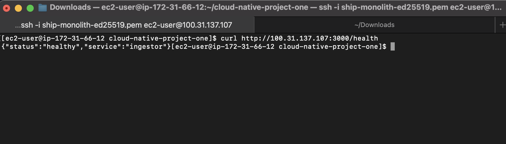

### 2. PM2 Process Status: All Three Services Running

Command run on EC2:

```bash
pm2 status
```

Shows `ingestor`, `worker`, and `executor` all in `online` status, managed by PM2 on a single `t3.micro` instance.

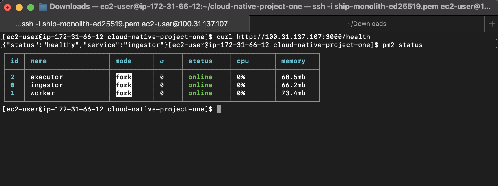

### 3. Send Test Telemetry: End-to-End Pipeline Trigger

Command run from EC2:

```bash
curl -X POST http://<EC2_PUBLIC_IP>:3000/telemetry \
  -H "Content-Type: application/json" \
  -d '{"ship_id":"ship_1","temp":-12.5,"timestamp":"2026-02-11T05:00:00Z"}'
```

Response includes `messageId`, confirming the Ingestor validated the payload and queued it to SQS.

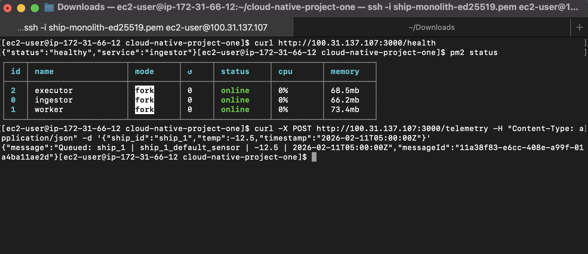

### 4. PM2 Logs: Message Flow Through Pipeline

Command run on EC2:

```bash
pm2 logs --lines 30
```

Logs show the complete message flow:

1. **Ingestor**: Received POST, validated, queued to TelemetryQueue
2. **Worker**: Polled TelemetryQueue, retrieved thresholds from Redis, evaluated rules (NORMAL), published event to EventsQueue
3. **Executor**: Polled EventsQueue, stored telemetry reading in PostgreSQL, batch-deleted message

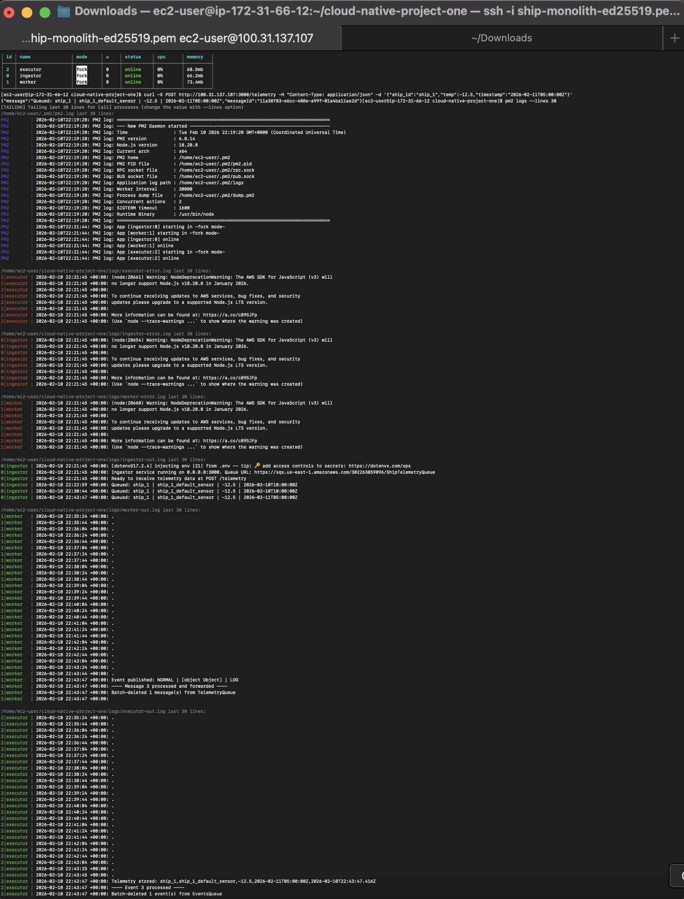

### 5. Database Query: Telemetry Stored in RDS PostgreSQL

Command run on EC2:

```bash
psql -h <RDS_ENDPOINT> -U postgres -d ship_db \
  -c "SELECT * FROM telemetry_readings ORDER BY created_at DESC LIMIT 10;"
```

Shows the stored telemetry row(s) with `ship_id`, `sensor_id`, `temperature`, and `timestamp`, proving data traversed the full pipeline (HTTP → SQS → Worker → SQS → Executor → PostgreSQL).


### 6. Alerts Table: Business Rule Output Stored

A critical temperature reading (`-1°C`, above the `-5°C` critical threshold) was sent to trigger the alert pipeline. Command run on EC2:

```bash
psql -h <RDS_ENDPOINT> -U postgres -d ship_db \
  -c "SELECT * FROM alerts ORDER BY created_at DESC LIMIT 10;"
```

Shows two alerts generated by the Worker's business rule evaluation:

1. **NOTIFY_CRITICAL**: alert created with message `-1 > -5 degrees threshold`
2. **ADJUST_TEMPERATURE**: automatic temperature correction requested

This confirms the Worker correctly identified the CRITICAL condition, published two action events to EventsQueue, and the Executor persisted both alerts to PostgreSQL.

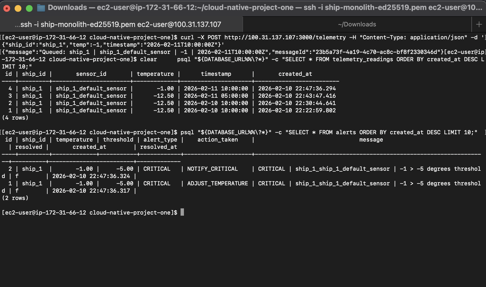

## IX. Deployment Verification (Implementation 2: Distributed EC2)

The following screenshots demonstrate the system running across **three separate EC2 instances**, each running a single component. The same SQS queues, RDS PostgreSQL, and ElastiCache Redis from Implementation 1 are reused; only the compute layer changed.

### 1. Infrastructure Reuse

| Resource | Reused from Implementation 1 |
| -------- | ---------------------------- |
| SQS (ShipTelemetryQueue, AlertEventsQueue) | Same queues |
| RDS PostgreSQL | Same database and tables |
| ElastiCache Redis | Same cache and thresholds |
| IAM Role | Same role attached to all 3 instances |
| Security Groups (RDS/ElastiCache) | Shared security group |
| Code | Identical codebase, identical `.env` |
| Original EC2 | Reused, now will only deploy the Ingestor |

#### a. RDS setup

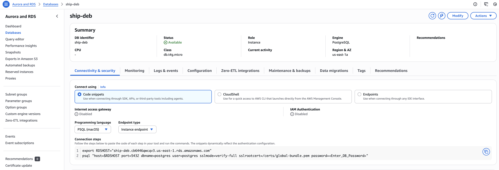
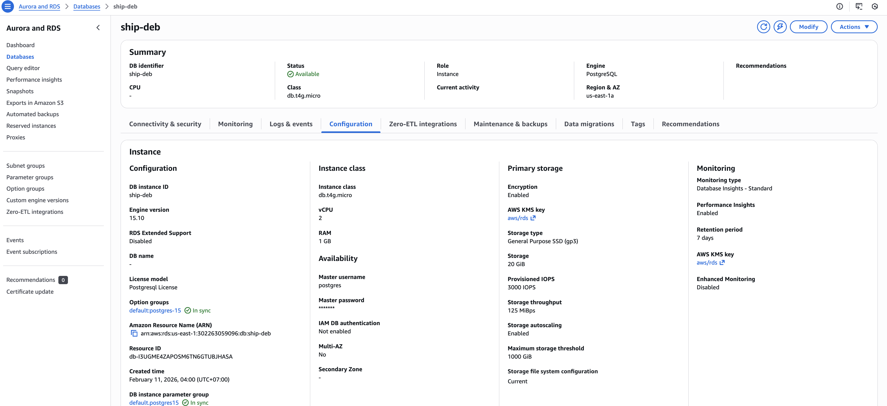

#### b. Redis setup

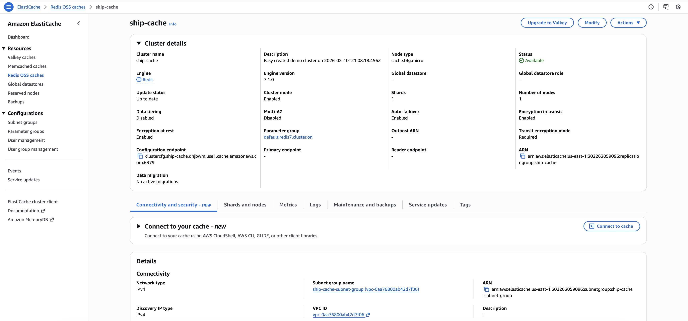

#### c. Queues setup

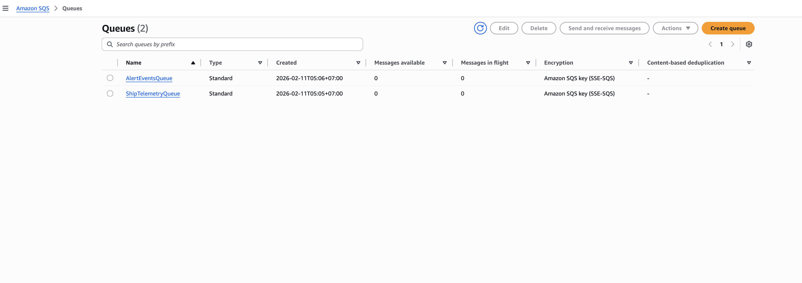


### 2. Instance Layout

| Instance | Role | Process Running | Public Access |
| -------- | ---- | --------------- | ------------- |
| EC2 #1 (original) | Ingestor | `pm2 start ingestor/ingestor.js` | Port 3000 open |
| EC2 #2 (new) | Worker | `pm2 start worker/worker.js` | SSH only |
| EC2 #3 (new) | Executor | `pm2 start executor/executor.js` | SSH only |

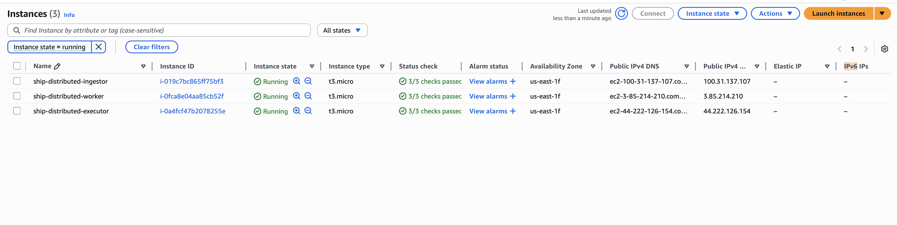
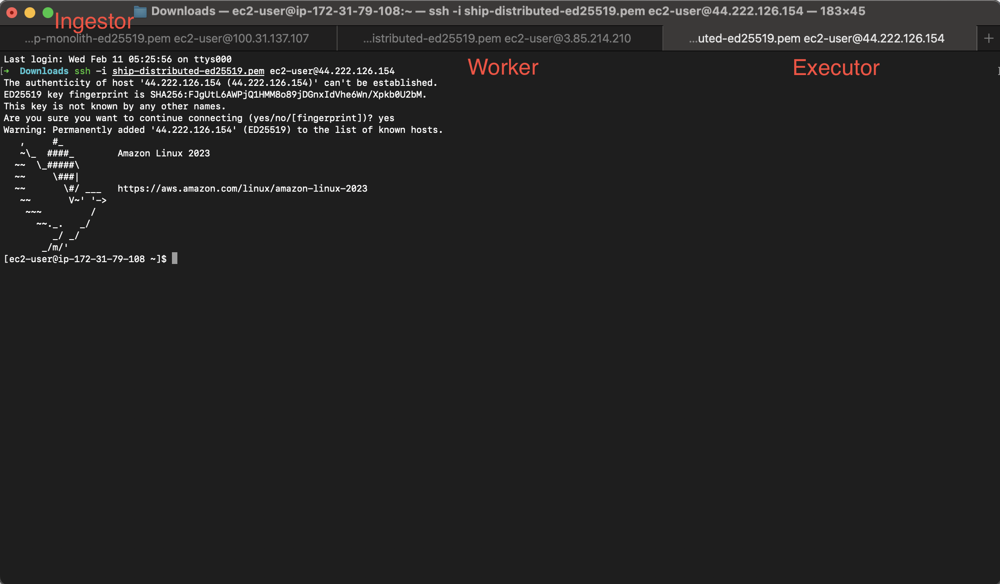

### 3. PM2 Status: Each Instance Runs One Process

Each EC2 instance runs only its designated component via PM2:

- **Ingestor instance**: `pm2 status` shows only `ingestor` online
- **Worker instance**: `pm2 status` shows only `worker` online
- **Executor instance**: `pm2 status` shows only `executor` online

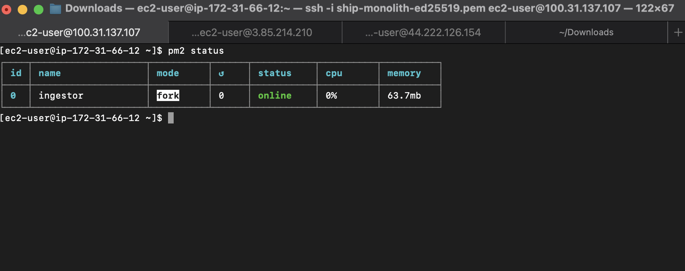
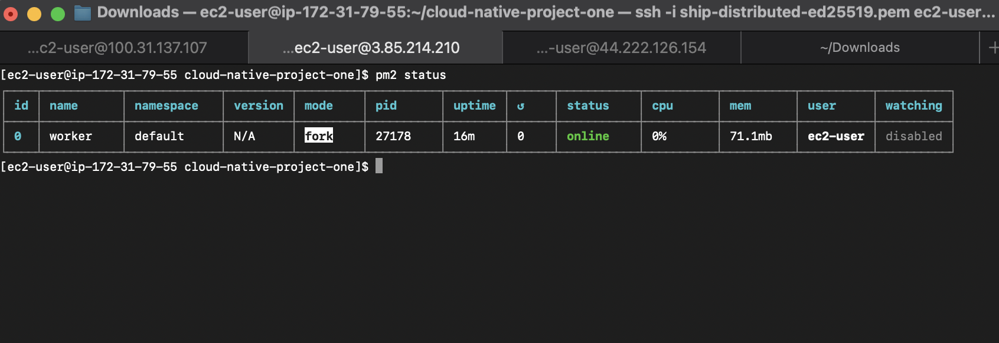
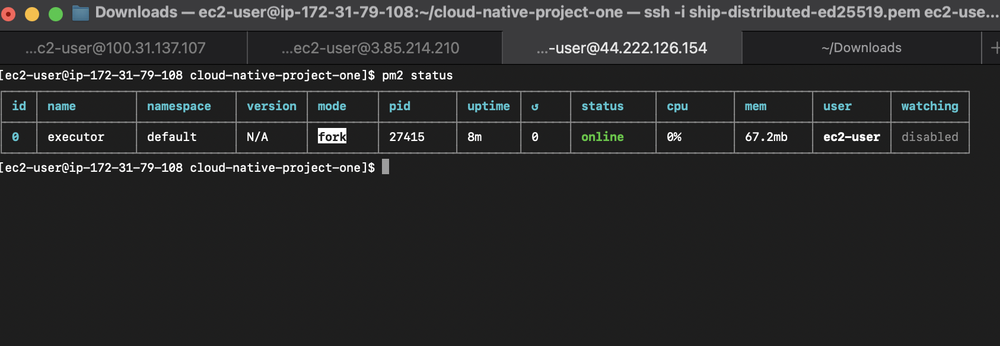

### 4. Send Test Telemetry: Cross-Instance Pipeline

Command run from local machine to the Ingestor instance:

```bash
curl -X POST http://<INGESTOR_EC2_IP>:3000/telemetry \
  -H "Content-Type: application/json" \
  -d '{"ship_id":"ship_1","temp":-1,"timestamp":"2026-02-11T12:00:00Z"}'
```

Response includes `messageId`, confirming the Ingestor queued the message to SQS.

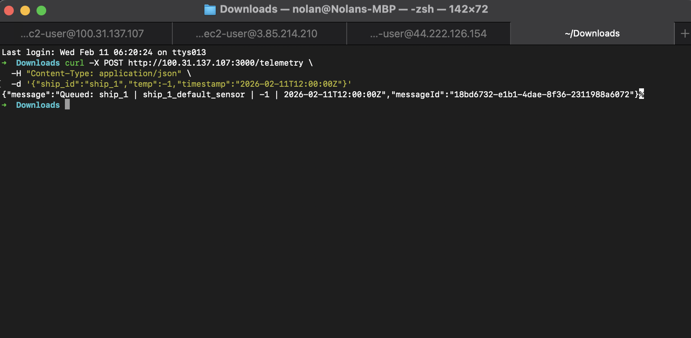

### 5. Distributed Logs: Message Flow Across Instances

Logs from each instance confirm the message traversed the full pipeline across three separate EC2 instances:

1. **Ingestor instance** (`pm2 logs`): Received POST, validated, queued to TelemetryQueue
2. **Worker instance** (`pm2 logs`): Polled TelemetryQueue, retrieved thresholds from Redis, evaluated rules (CRITICAL), published events to EventsQueue
3. **Executor instance** (`pm2 logs`): Polled EventsQueue, stored telemetry and alerts in PostgreSQL

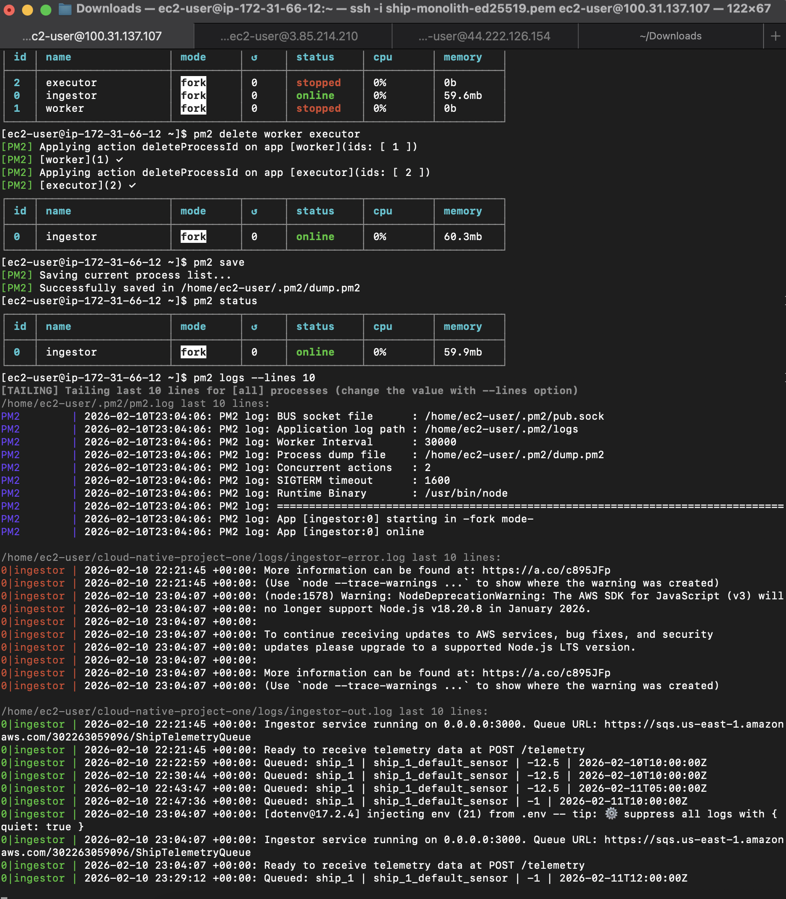
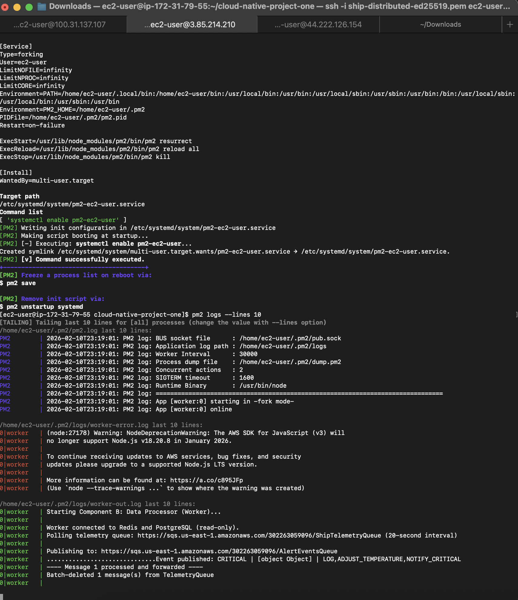
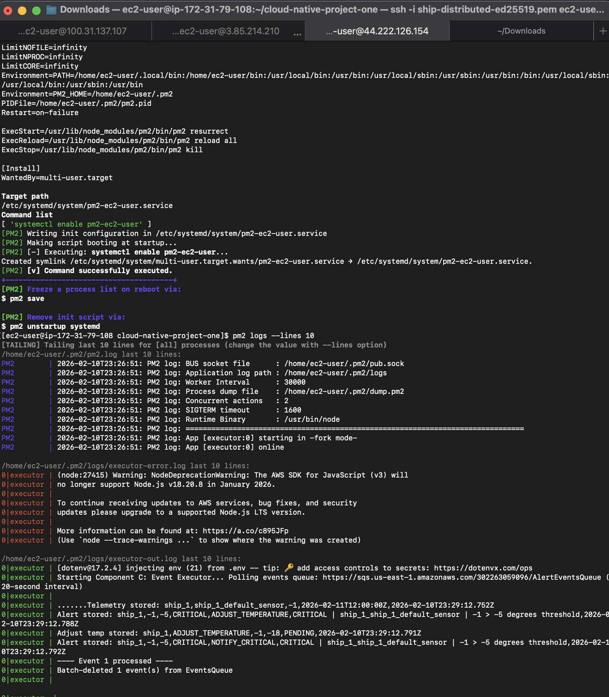

### 6. Database Query: Data Stored via Distributed Pipeline

Command run on Executor instance:

```bash
psql -h <RDS_ENDPOINT> -U postgres -d ship_db \
  -c "SELECT * FROM telemetry_readings ORDER BY created_at DESC LIMIT 10;"
```

Shows the telemetry row stored by the Executor running on its own EC2 instance, confirming the distributed pipeline works end-to-end.

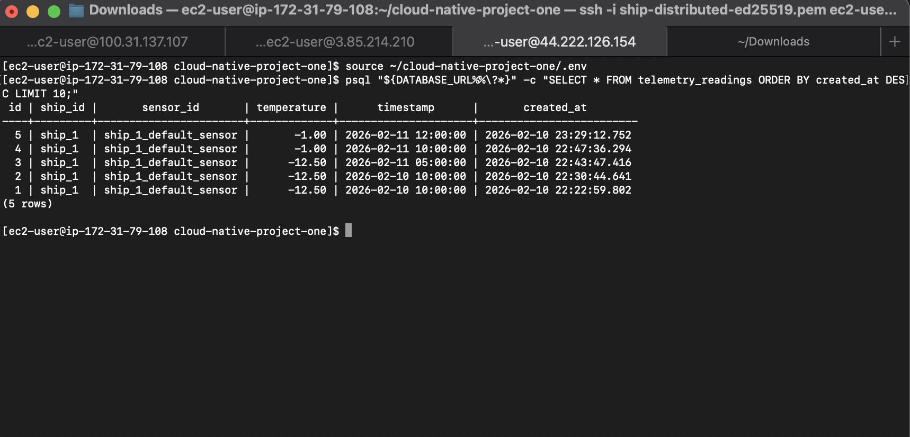

## X. Future Enhancements

### 1. Notification System

- Email alerts via Amazon SES
- SMS notifications via Amazon SNS
- Webhook integrations for third-party systems

### 2. Monitoring Dashboard

- Real-time temperature visualization
- Alert history and trends
- Fleet-wide overview

### 3. API Enhancements

- Authentication (API keys or JWT)
- Rate limiting
- API documentation (Swagger/OpenAPI)

### 4. Advanced Analytics

- Temperature trend prediction
- Anomaly detection using machine learning
- Route optimization based on historical data

### 5. High Availability

- Multi-AZ RDS deployment
- ElastiCache replication
- Auto-scaling groups for EC2

### 6. CI/CD Pipeline

- GitHub Actions for automated deployment
- Automated testing on pull requests
- Blue-green deployments

### 7. Multi-Region Deployment

- Deploy in multiple AWS regions
- Route53 for global load balancing
- Cross-region replication for disaster recovery

### 8. Serverless Migration (if constraints removed)

- Lambda functions for worker
- API Gateway for ingestor
- DynamoDB for high-throughput storage

### 9. IoT Core Integration

- Direct device-to-cloud communication
- Device shadows for offline support
- Fleet provisioning and management

## XI. Appendix

### a. Repository Structure

```text
cloud-native-project-one/
├── ingestor/              # Component A: Data Ingestion
├── worker/                # Component B: Data Processing (Business Rules)
├── executor/              # Component C: Event Executor (Storage + Notifications)
├── shared/                # Shared configuration (config.js)
├── scripts/               # Setup scripts (db, cache, sqs)
├── seed/                  # Seed data (ship-thresholds.json)
├── simulator/             # IoT simulator and docker-compose
├── deploy/                # PM2 ecosystem config for AWS
├── docs/                  # Documentation
└── README.md              # Project overview
```

### b. Key Files

- `docs/PROJECT_REPORT.md`: This report
- `deploy/pm2-ecosystem.config.cjs`: PM2 process management config

### c. Technologies Used

- **Runtime**: Node.js 18+
- **Framework**: Express.js
- **AWS SDK**: @aws-sdk/client-sqs
- **Database Client**: pg (PostgreSQL)
- **Cache Client**: redis
- **Process Manager**: PM2
- **Infrastructure**: Docker Compose (local), PM2 (AWS)
